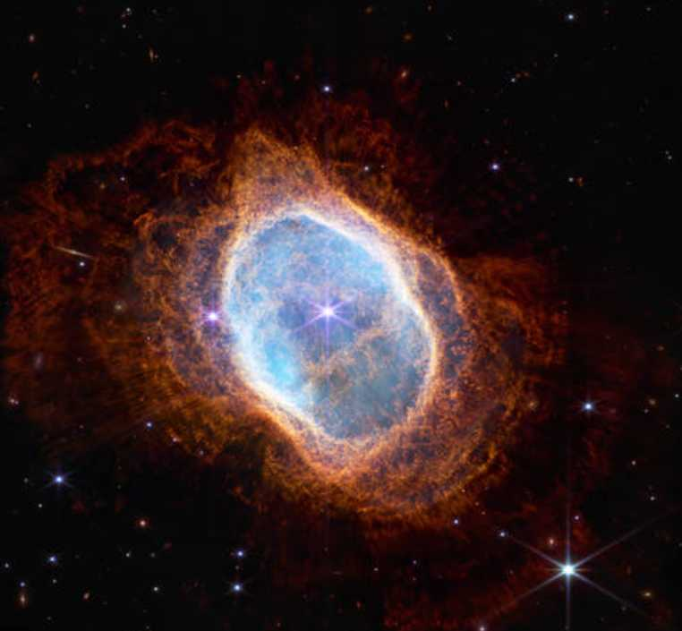

<!-- README.md is generated from README.Rmd. Please edit that file -->

```{r, include = FALSE}
knitr::opts_chunk$set(
  collapse = TRUE,
  comment = "#>",
  fig.path = "man/figures/README-",
  out.width = "100%"
)
```

# jwst

<!-- badges: start -->
[](https://github.com/erictleung/jwst/actions/workflows/R-CMD-check.yaml)
[](https://img.shields.io/github/license/erictleung/jwst)
[](https://project-types.github.io/#toy)
<!-- badges: end -->

The goal of jwst is to be an R color palette inspired by the beautiful images
from the James Webb Space Telescope (JWST).

More on the JWST itself here https://jwst.nasa.gov/index.html.

## Installation

You can install the development version of jwst like so:

```r
remotes::install_github("erictleung/jwst")
```

## Example

This is a basic example which shows you how to solve a common problem:

```{r example}
library(jwst)

names(jwst_palettes)
```

You can call the palette in just one command.

```{r palette_carina, fig.height=2, fig.width=6}
jwst("carina")
```


If you want a specific number of colors, you can also do that.

```{r palette_carina_three, fig.height=2, fig.width=6}
jwst("carina", 3)
```

```{r palette_smacs, fig.height=2, fig.width=6}
jwst("smacs")
```


```{r palette_southern_nebula_1, fig.height=2, fig.width=6}
jwst("southern_nebula_1")
```




```{r palette_southern_nebula_2, fig.height=2, fig.width=6}
jwst("southern_nebula_2")
```


```{r palette_stephans, fig.height=2, fig.width=6}
jwst("stephans_quintet")
```


## Generating your own

If you don't like the color here, you can experiment and make your own!

```{r example_generate_palette}
library(imgpalr)

set.seed(1)

(x <- paste0(system.file(package = "jwst"), "/help/figures/carina.jpg"))

image_pal(
  x[1],
  type = "div",
  saturation = c(0.75, 1),
  brightness = c(0.75, 1),
  plot = TRUE
)
```


List other images available.

```{r}
list.files(paste0(system.file(package = "jwst"), "/help/figures"))
```

See https://github.com/leonawicz/imgpalr for more.


## Acknowledgements

Code largely inspired and attributable to
https://github.com/ciannabp/inauguration.

Color palettes were generated using https://github.com/leonawicz/imgpalr.

Images from NASA's James Webb Space Telescope (JWST) 
https://www.nasa.gov/webbfirstimages.
