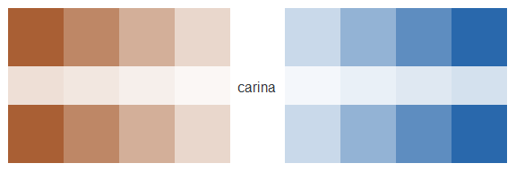
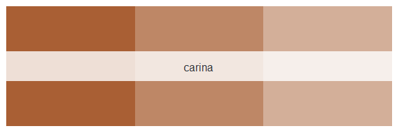
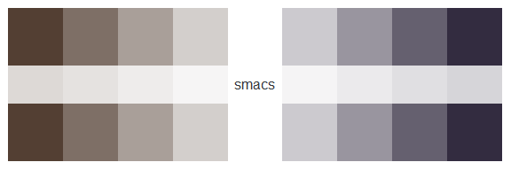
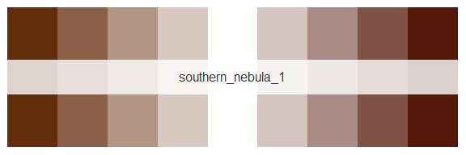
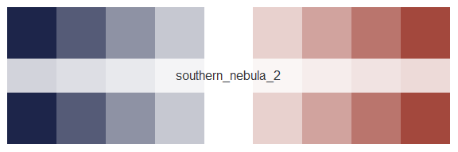
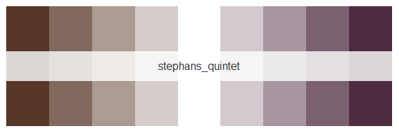
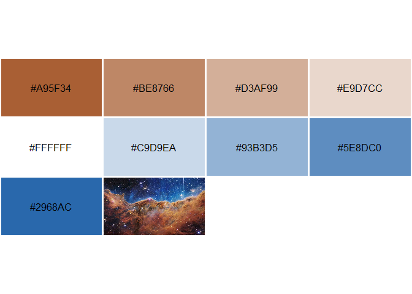

<!-- README.md is generated from README.Rmd. Please edit that file -->

# jwst

<!-- badges: start -->

[](https://github.com/erictleung/jwst/actions/workflows/R-CMD-check.yaml)
[](https://img.shields.io/github/license/erictleung/jwst)
[](https://project-types.github.io/#toy)
<!-- badges: end -->

The goal of jwst is to be an R color palette inspired by the beautiful
images from the James Webb Space Telescope (JWST).

More on the JWST itself here <https://jwst.nasa.gov/index.html>.

## Installation

You can install the development version of jwst like so:

``` r
remotes::install_github("erictleung/jwst")
```

## Example

This is a basic example which shows you how to solve a common problem:

``` r
library(jwst)

names(jwst_palettes)
#> [1] "carina"            "smacs"             "southern_nebula_1"
#> [4] "southern_nebula_2" "stephans_quintet"
```

You can call the palette in just one command.

``` r
jwst("carina")
```




If you want a specific number of colors, you can also do that.

``` r
jwst("carina", 3)
```



``` r
jwst("smacs")
```




``` r
jwst("southern_nebula_1")
```




``` r
jwst("southern_nebula_2")
```




``` r
jwst("stephans_quintet")
```




## Generating your own

If you don’t like the color here, you can experiment and make your own!

``` r
library(imgpalr)
#> Warning: package 'imgpalr' was built under R version 4.1.3

set.seed(1)

(x <- paste0(system.file(package = "jwst"), "/help/figures/carina.jpg"))
#> [1] "C:/Users/leune006/R/win-library/4.1/jwst/help/figures/carina.jpg"

image_pal(
  x[1],
  type = "div",
  saturation = c(0.75, 1),
  brightness = c(0.75, 1),
  plot = TRUE
)
```



    #> [1] "#A95F34" "#BE8766" "#D3AF99" "#E9D7CC" "#FFFFFF" "#C9D9EA" "#93B3D5"
    #> [8] "#5E8DC0" "#2968AC"

List other images available.

``` r
list.files(paste0(system.file(package = "jwst"), "/help/figures"))
#>  [1] "carina.jpg"                            
#>  [2] "README-example_generate_palette-1.png" 
#>  [3] "README-palette_carina-1.png"           
#>  [4] "README-palette_carina_three-1.png"     
#>  [5] "README-palette_smacs-1.png"            
#>  [6] "README-palette_southern_nebula_1-1.png"
#>  [7] "README-palette_southern_nebula_2-1.png"
#>  [8] "README-palette_stephans-1.png"         
#>  [9] "smacs.jpg"                             
#> [10] "southernringnebula_1.jpg"              
#> [11] "southernringnebula_2.jpg"              
#> [12] "stephansquintet.jpg"
```

See <https://github.com/leonawicz/imgpalr> for more.

## Acknowledgements

Code largely inspired and attributable to
<https://github.com/ciannabp/inauguration>.

Color palettes were generated using
<https://github.com/leonawicz/imgpalr>.

Images from NASA’s James Webb Space Telescope (JWST)
<https://www.nasa.gov/webbfirstimages>.
