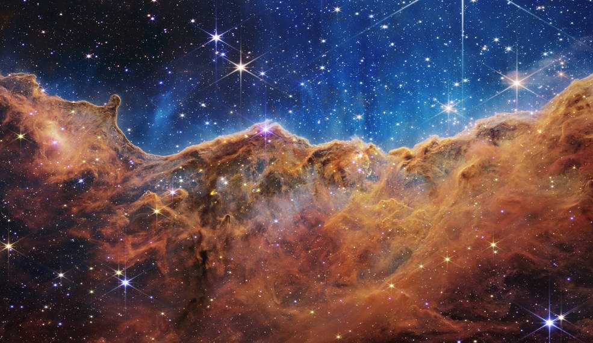
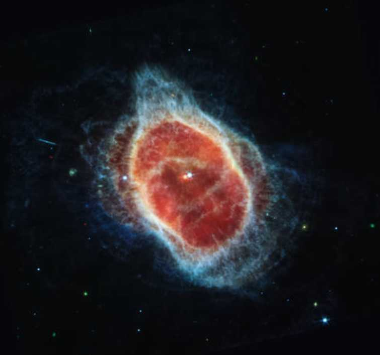

<!-- README.md is generated from README.Rmd. Please edit that file -->

# jwst

<!-- badges: start -->
<!-- badges: end -->

The goal of jwst is to be an R color palette inspired by the beautiful
images from the JWST.

## Installation

You can install the development version of jwst like so:

``` r
remotes::install_github("erictleung/jwst")
```

## Example

This is a basic example which shows you how to solve a common problem:

``` r
library(jwst)

names(jwst_palettes)
#> [1] "carina"            "smacs"             "southern_nebula_1"
#> [4] "southern_nebula_2" "stephans_quintet"
```

You can call the palette in just one command.

``` r
jwst("carina")
```




If you want a specific number of colors, you can also do that.

``` r
jwst("carina", 3)
```


``` r
jwst("smacs")
```


``` r
jwst("southern_nebula_1")
```


``` r
jwst("southern_nebula_2")
```




``` r
jwst("stephans_quintet")
```


## Generating your own

If you don’t like the color here, you can experiment and make your own!

``` r
library(imgpalr)
#> Warning: package 'imgpalr' was built under R version 4.1.3

set.seed(1)

(x <- paste0(system.file(package = "jwst"), "/help/figures/carina.jpg"))
#> [1] "C:/Users/leune006/R/win-library/4.1/jwst/help/figures/carina.jpg"

image_pal(
  x[1],
  type = "div",
  saturation = c(0.75, 1),
  brightness = c(0.75, 1),
  plot = TRUE
)
```


    #> [1] "#A95F34" "#BE8766" "#D3AF99" "#E9D7CC" "#FFFFFF" "#C9D9EA" "#93B3D5"
    #> [8] "#5E8DC0" "#2968AC"

List other images available.

``` r
list.files(paste0(system.file(package = "jwst"), "/help/figures"))
#>  [1] "carina.jpg"                   "README-unnamed-chunk-2-1.png"
#>  [3] "README-unnamed-chunk-3-1.png" "README-unnamed-chunk-4-1.png"
#>  [5] "README-unnamed-chunk-5-1.png" "README-unnamed-chunk-6-1.png"
#>  [7] "README-unnamed-chunk-7-1.png" "README-unnamed-chunk-8-1.png"
#>  [9] "smacs.jpg"                    "southernringnebula_1.jpg"    
#> [11] "southernringnebula_2.jpg"     "stephansquintet.jpg"
```

See <https://github.com/leonawicz/imgpalr> for more.

## Acknowledgements

Images from NASA’s James Webb Space Telescope (JWST)
<https://www.nasa.gov/webbfirstimages>.
